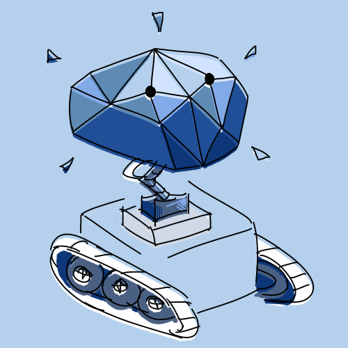

# UTMIST Assistant (MISTA)

The UofT Machine Intelligence Student Team Assistant (MISTA) is a Discord bot serving the UTMIST Discord server (https://discord.gg/88mSPw8).

- MISTA is written in [Go](https://golang.org/) and uses [discordgo](https://github.com/bwmarrin/discordgo) and [go-gitlab](https://github.com/xanzy/go-gitlab).
- It can manage server roles and permissions.
- Our [website (utmist.gitlab.io)](https://utmist.gitlab.io) can be updated via MISTA on our server by triggering jobs for GitLab Pages CI running [utmist.gitlab.io](https://gitlab.com/utmist/utmist.gitlab.io).
- MISTA also has Event, Prejct, and Media interfaces to provide resources and information on our server.

## Development

The bot is written to work on any Linux/OSX/Windows environment with internet access.

### Prerequisites

- [Go](https://golang.org/).
- See [Go-Gitlab Docs](https://godoc.org/github.com/xanzy/go-gitlab)

### Setup/Housekeeping

- Run `sh go-get.sh` to downloade dependencies.
- The `.env` file in the form of `.env.copy` is required to run this bot.
- The bot is entirely run from `main.go`.
- [Discord Invite Link](https://discordapp.com/oauth2/authorize?client_id=682495255102095391&scope=bot).

### Developers

- Robbert Liu, MISTA Lead Developer.
- [Robert (Rupert) Wu (me)](https://leglesslamb.gitlab.io), VP Infrastructure.
- If you're a member of UTMIST and would like to contribute or learn development through this project, you can join our [Discord](https://discord.gg/88mSPw8)) and let us know in _#infrastructure_.
